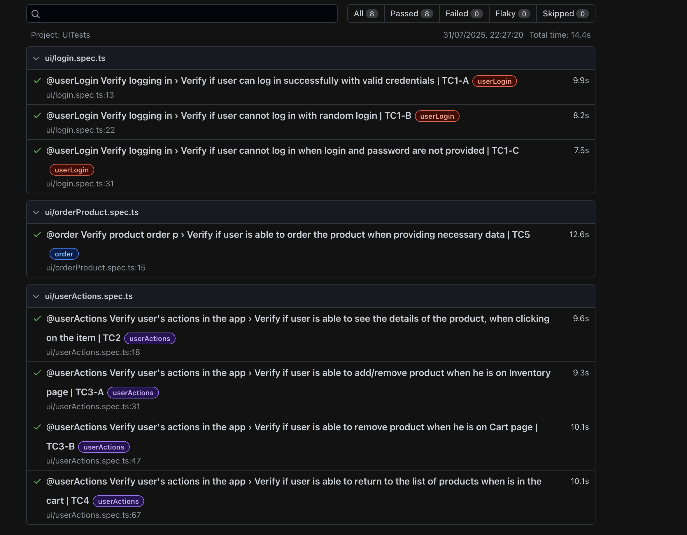

# UI Tests for Code & Pepper by Apohl

This project contains UI tests for `Swag Labs` application.

The tests are written in TypeScript and Playwright for browser automation 

## Prerequisite

- Make sure you have Node installed

## Install

- `npm install` - install dependencies
- `npx playwright install` - install playwright                                             ║


## Important

By default application will run on `https://www.saucedemo.com/`

## Environment Variables

To run tests, necessary environment variables must be set. You should define these variables in a `.env` file. You can use the `Sample.env` file present in the project as a boilerplate. 
Please remove the Sample prefix,  there is no need to modify the values.
The data within the file are public for simplicity. However, in real-world practice, 
this file contains sensitive credentials and should not be included in version control.
Therefore, the `.env `file has been added to .gitignore to prevent accidental pushes to the repository.

```
BASE_URL='https://www.saucedemo.com/'
TEST_USERNAME='standard_user'
TEST_PASSWORD='secret_sauce'
```

## Run all tests in Playwright 

Run this command to run all tests parallel:
- `npx playwright test`

However, if you prefer to run the tests sequentially, without parallelization, use the following command instead:
- `npx playwright test --workers=1 --project=UITests`

## Run chosen tests in Playwright

Run these commands if you want to run only chosen set of tests:
- `npx playwright test --grep @userLogin --workers=1 --project=UITests`
- `npx playwright test --grep @order --workers=1 --project=UITests`
- `npx playwright test --grep @userActions --workers=1 --project=UITests`

## Reports

To check report run command:
- `npx playwright show-report html-report`

## Test cases

- TC 1 - Login with valid and invalid credentials
- TC 2 - User is able to see the details of the product when clicking on the product
- TC 3 - User is able to add/remove product from the cart when he is on Inventory page/Cart Page
- TC 4 - User is able to return to the list of products when is in the cart
- TC 5 - User is able to order the product when providing necessary data

## Tests results


